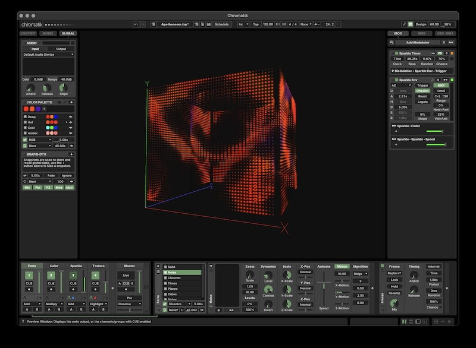

_Apo·then·eum_ (place of divine elevation) is a visual, sonic and haptic instrument designed to transport visitors through participatory immersion.

Comprised of two nested chambers made of back-to-back LED nets (13,280 nodes in all), Apotheneum presents four independent canvases and an immersive sound system for collaborating visual and sound artists to play. Measuring 40&times;40&times;40 feet, Apotheneum's cubic antechamber envelops a thirty-foot cylindrical inner sanctum that opens to the sky and is anchored by a 24-foot pressure-sensing bed from which vantage point our three primary somatic senses are engaged.

This repository contains materials used to Apotheneum's animation engine in the [Chromatik](https://chromatik.co/) Digital Lighting Workstation.

Learn more on the [Apotheneum Wiki &rarr;](https://github.com/Apotheneum/Apotheneum/wiki)

---

### Getting Started

This package currently requires macOS on an Apple Silicon machine. Windows instructions will be added in the future.

#### Installing Chromatik


* Download the latest [Chromatik release](https://chromatik.co/download/)
* Register a [Chromatik account](https://chromatik.co/login)
* Authorize Chromatik with your free license

#### Apotheneum Assets

* Download the latest [Apotheneum release](https://github.com/Apotheneum/Apotheneum/releases/download/2025.05.16/apotheneum-0.0.1-SNAPSHOT.jar)
* Open Chromatik, drag-and-drop the Apotheneum file `apotheneum-0.0.1-SNAPSHOT.jar` onto the application window
* From Chromatik, open the example project file `~/Chromatik/Projects/Apotheneum/Apotheneum.lxp`

Need more help?<br />
[Installation Guide &rarr;](https://github.com/Apotheneum/Apotheneum/wiki/Installation-Guide)

Learn how to create animation content.<br />
[Chromatik User Guide &rarr;](https://chromatik.co/guide/)<br />
[Chromatik Developer Guide &rarr;](https://chromatik.co/develop/)

Know the limitations of developing large-scale animation on a computer monitor.<br />
[Simulation Principles &rarr;](https://github.com/Apotheneum/Apotheneum/wiki/Simulation-Principles)



---

### Software Development

Coding experience is neither required nor necessary to build animation content in Chromatik. But for those comfortable with basic Java coding, Chromatik offers an extensible framework for custom animation development.

Install the following tools:

* [Java 21 Temurin](https://adoptium.net/)
* [Maven](https://maven.apache.org/)

Maven can be installed using [Homebrew](https://brew.sh/) via the following command:

```
$ brew install maven
````

After developing new animation content, you may install it by running `update.command` or invoking Maven directly:

```
$ mvn install
````

An example animation routine is provided at [`StripePattern.java`](src/main/java/apotheneum/examples/StripePattern.java)

A more general overview of the content package structure is provided in the [LXPackage Template Repository &rarr;](https://github.com/heronarts/LXPackage)

Learn more by reading the [Chromatik Developer Guide](https://chromatik.co/develop/)
